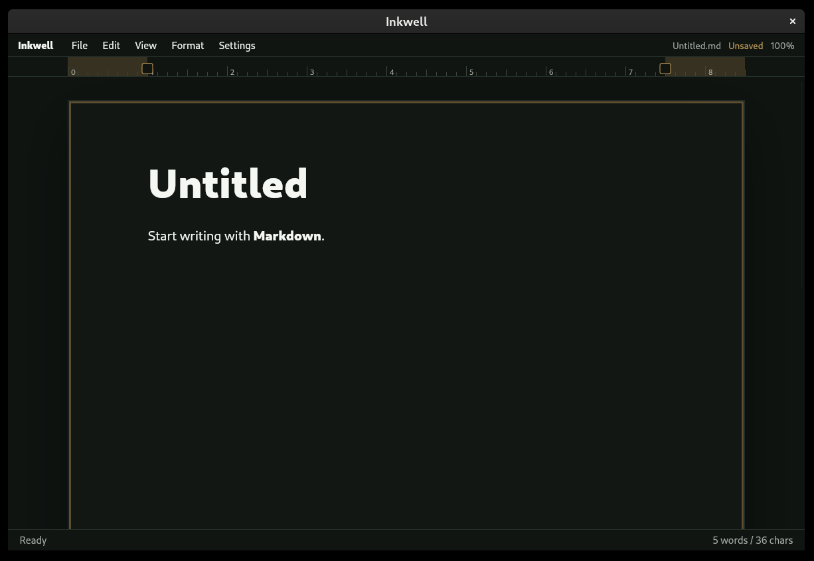

# Inkwell

Inkwell is a local-first Markdown editor for Linux and macOS.

It stores Markdown files locally and does not require accounts, sync, telemetry, or remote services. The Linux app uses GTK and WebKitGTK. The macOS app is an experimental local build that uses AppKit and WKWebView.



## Features

- Open, save, save as, and new document workflows
- Recent document access on macOS
- Multi-window editing
- Find and replace, Use Selection for Find, and keyboard navigation
- Dark and light themes, with macOS system appearance support
- Keyboard shortcuts, including Command-key shortcuts on macOS
- Markdown formatting for headings, emphasis, lists, quotes, code blocks, tables, task lists, and horizontal rules
- Basic table editing
- macOS spelling suggestions, basic grammar checks, and read-aloud controls
- Print, page setup, Markdown export, and HTML export commands
- Zoom controls with a status-bar zoom indicator away from 100%
- Word and character counts

## Requirements

npm is used for project scripts.

Linux requirements:

- Git
- Python 3
- Node.js and npm
- GTK 3
- WebKitGTK 4.1 Python/GObject bindings
- desktop-file-utils

On Debian or Ubuntu:

```bash
sudo apt install git nodejs npm python3 python3-gi gir1.2-gtk-3.0 gir1.2-webkit2-4.1 desktop-file-utils
```

Package names vary by distribution. On other Linux distributions, install the equivalent packages for Python 3, GTK 3, WebKitGTK 4.1 introspection bindings, Node.js, npm, and desktop-file-utils.

macOS requirements:

- macOS 13 or newer
- Node.js and npm
- Xcode Command Line Tools or Xcode with Swift, AppKit, WebKit, `sips`, `iconutil`, and `codesign`

The macOS build is currently a local development build. It is not notarized, sandboxed, or distributed through the Mac App Store.

On first launch, the macOS app may offer to make Inkwell the default editor for Markdown files. Choosing "Don't Ask Again" saves that preference locally and suppresses the prompt on future launches.

## Run From Source

Linux:

```bash
git clone https://github.com/VendorBuyMVP/Inkwell.git
cd Inkwell
npm run linux:run
```

Open a Markdown file directly on Linux:

```bash
npm run linux:run -- path/to/file.md
```

macOS:

```bash
git clone https://github.com/VendorBuyMVP/Inkwell.git
cd Inkwell
npm run macos:build
open build/macos-local/Inkwell.app
```

Open a Markdown file directly on macOS:

```bash
open -n build/macos-local/Inkwell.app --args path/to/file.md
```

Run the macOS local smoke check:

```bash
npm run macos:smoke
```

## Install Locally

Linux:

```bash
npm run linux:install
inkwell
```

The Linux installer adds a desktop entry and registers Markdown file associations.

There is not yet a macOS installer. Build the local macOS app with `npm run macos:build` and open `build/macos-local/Inkwell.app`.

## WebKit Notes

The Linux app uses WebKitGTK as the editor surface. It is configured for local files only and is not intended to browse the web or load remote content.

The macOS app uses WKWebView for the editor surface. The current local build loads bundled frontend code into an in-memory document and is intended for local editing only. The sandboxed Mac App Store path is not release-ready yet.

## Development

Run the project checks on a Linux machine with the Linux desktop validation tooling installed:

```bash
npm run check
```

Release checks require `desktop-file-validate` and `appstreamcli` in addition to the runtime dependencies above. On Debian or Ubuntu, those are provided by `desktop-file-utils` and `appstream`.

Run the runtime no-network smoke check against the Linux launcher:

```bash
npm run security:runtime
```

Run macOS local build verification:

```bash
npm run macos:smoke
```

## Contributing

Contributions are welcome. Please fork the repository, create a focused branch, and submit a pull request with:

- A concise summary of what changed
- The user-facing impact
- Screenshots or notes for UI changes
- The checks you ran

Before opening a pull request, run:

```bash
npm run check
```

For macOS work, also run:

```bash
npm run macos:build
npm run macos:smoke
```

For packaging or security-sensitive changes, run the relevant validation script as well:

```bash
npm run security:artifacts
```

Inkwell is local-first. Pull requests should preserve the project posture: no telemetry, no remote code loading, no silent persistence of document contents, no unsafe Markdown rendering, and no runtime npm dependencies unless the change explains why they are necessary.

## License

MIT
